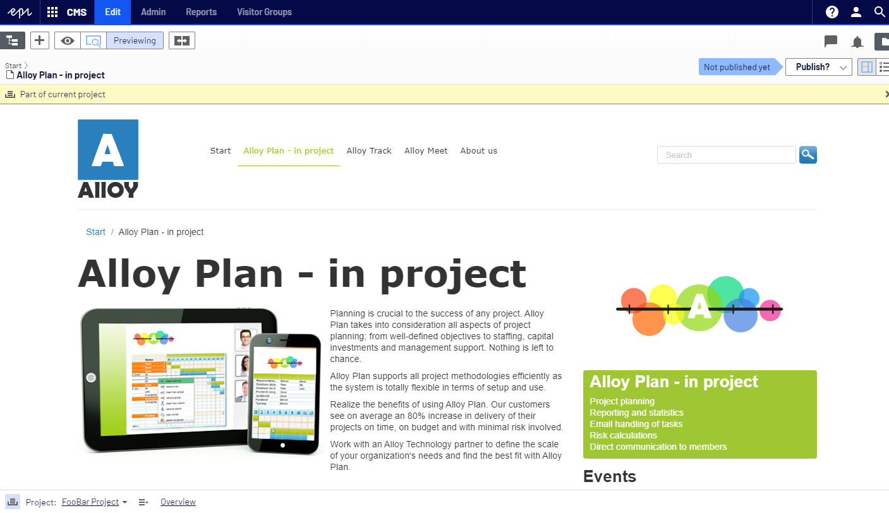
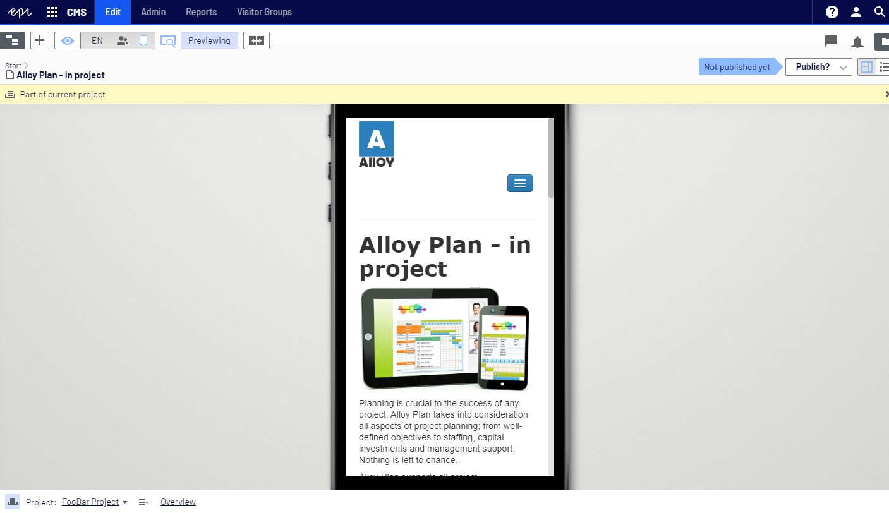
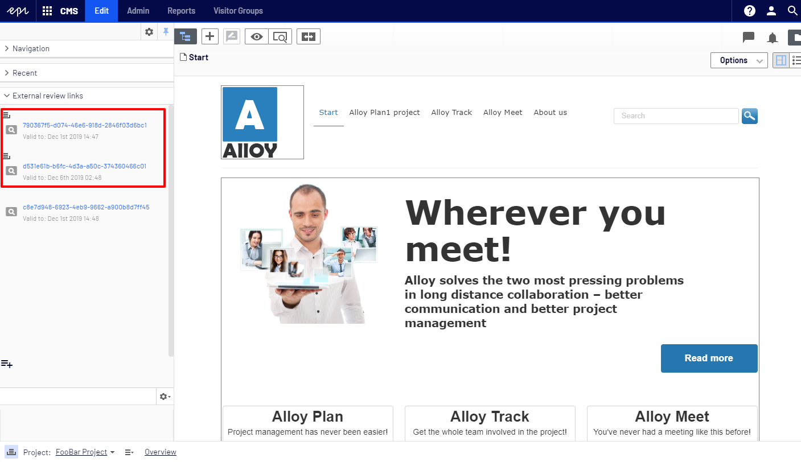
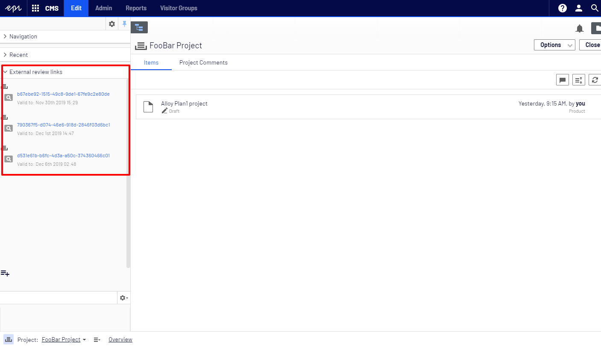
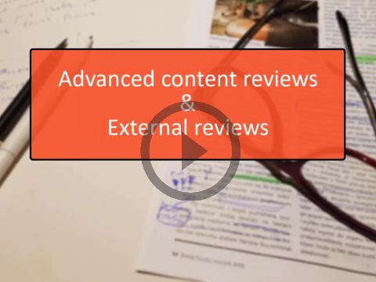

## Introduction

Projects are great feature. They let you manage the publishing process for multiple related content items. 
For example, you can add a landing page, blocks, pages and products (if you have Commerce installed) to a 
project and publish them, manually or scheduled, at the same time. Projects support management of content 
in different language versions, so you can manage translation of content items in projects. 

### Project use case

Imagine an editor working on a new marketing campaign for the upcoming Black Friday. The end users need to 
see the newest deals and products. All content items need to be published exactly after Thanksgiving and 
editor's supervisor needs to sign off the work before it goes public.

There are a few ways to achieve this. One is to start off by creating a new project "Black Friday 2019".
Then probably adding some kind of Section Page "Black Friday 2019 Sale", then adding a bunch of sub pages,
blocks and marketing pictures. 

Once everything is up the editor needs to verify if the campaign is correct.

The only way to verify the project is to ask the Supervisor to log in to Edit Mode,
then choose a certain project from the Project Selector, open Preview Mode and try to _click through_ the 
section page.

There are several problems with this, first of all that user needs access to Edit Mode, needs to be familiar
with the editing UI, project selector etc..
It is not possible to use the View on website link, the preview has to be done inside Edit Mode in an iframe.
Edit Mode gives the ability to test how they page would look like on a different channel and different resolution:

However, it is not possible to see how the campaign will look like on a physical mobile device until it is 
publicly visible. 

## Advanced Reviews

One of the main purposes of the [advanced-reviews add-on](https://github.com/advanced-cms/advanced-reviews "Advanced Reviews Github") was to allow the end users to preview unpublished pages using 
tokenized and expirable urls. However, we never truly supported scenarios that involved projects. 
We would always try to load the common drafts associated with a certain token.

The ability to let end users preview the project has been requested many times and finally we are happy to say that 
the new version of the [advanced-reviews add-on](https://github.com/advanced-cms/advanced-reviews "Advanced Reviews Github") 
allows the editors to create a unique, tokenized urls that will allow the end users to preview unpublished projects.

## How it works

The rules are simple. When the Project Mode is active then all generated links will be associated with the current project.

 

As you can see the links with project icon (marked in Red in the screenshot above) will let the users to access the project.
After opening such link the user will be shown the project specific version of the page, additionally all its dependant
content items will also try to load project specific versions. All urls resolved on the page will also point the end user
to page versions that are part of the same project.

It means that by generating a single expirable url we can let any end user, even with no Edit Mode access the ability
to preview the whole campaign live, exactly as it will look after being published.

Project Overview view will display a combined list of all links generated to any content item associated with a certain project.
It will also give a way to Revoke the tokens at any time.
  

## How to install

Just update the nuget package to [v0.5.0](https://nuget.episerver.com/package/?id=Advanced.CMS.AdvancedReviews&v=0.5.0 "v0.5.0")

If for some reason you haven't seen advanced-reviews before and would like to know more please take a look at our 
[documentation](https://github.com/advanced-cms/advanced-reviews) on github.

Or view the marketing Video of the add-on.

