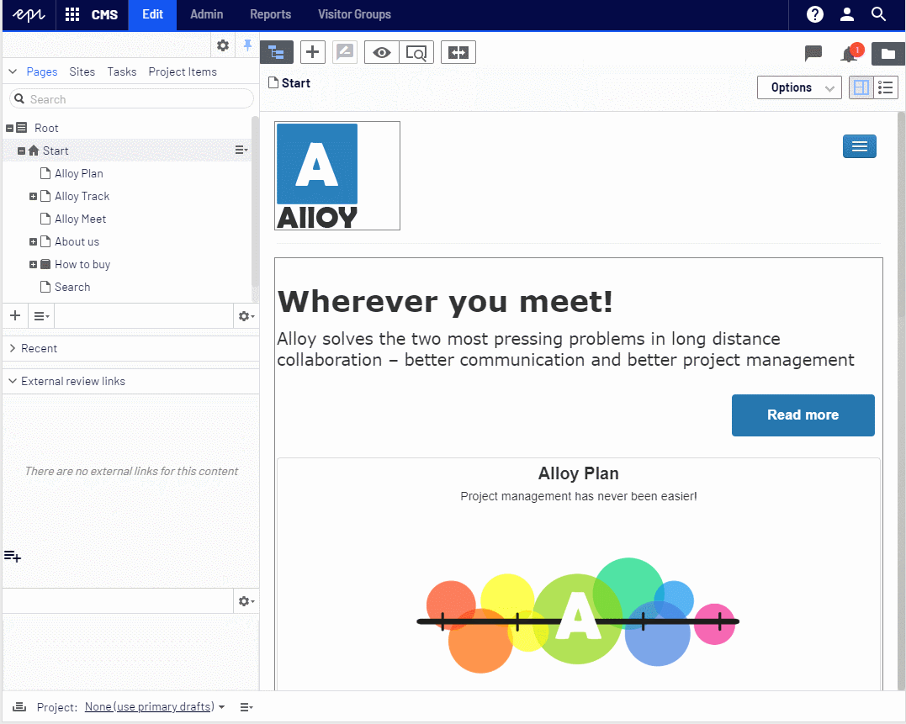

The idea behind [advanced-reviews](https://github.com/advanced-cms/advanced-reviews "Advanced Reviews Github") addon is to allow third-party Editors, 
who don't have access to Edit Mode, to be able to review unpublished content. 
In this article I'd like to describe how to secure external pages using new features that we recently implemented 
as well as all methods available in previous versions.

## Authenticating using user and password
Draft content version, which is unfinished Editor's work, should not be available to public users,
but only to those who we asked for review. Because of that, the safest option would be to create
credentials for all external reviewers and force them to login, before they could display the content. 
It's doable without custom code and requires configuring _externalContentView_ path in web.config:
```xml
<?xml version="1.0" encoding="utf-8"?>
<configuration>
  ...
  <location path="externalContentView">
    <system.web>
      <authorization>
        <allow roles="ExternalReviewers, WebEditors" />
        <deny users="*" />
      </authorization>
    </system.web>
  </location>
  ...
</configuration>
```
However, increasing level of security goes together with decreasing level of usability.
It will be more work for administrators, who have to manage accounts that should be available just for a time
necessary for reviewing the page, which is probably maximum few days. Also Reviewer should not be distracted 
with need to get login/password instead of focusing on their actual work to do.

## No authentication scenario
But even without authenticating all users, the addon provides some level of security
when accessing reviewed content:
* **hashing links** - links URLs are generated based on MD5 hash value, which is random and doesn't not depend on 
any content realted properties like _ContentLink_. It means that it's hard to guess URL to the content
* **expiration date** - each link has own expire date after that it's become inaccessible. The date is configurable
through the option object, separately for view and edit links. For example to set 2 days for editable links
and 3 days for view links:
```csharp
    [ModuleDependency(typeof(EPiServer.Web.InitializationModule))]
    public class ExternalReviewInitialization : IInitializableModule
    {
        public void Initialize(InitializationEngine context)
        {
            var options = ServiceLocator.Current.GetInstance<ExternalReviewOptions>();
            options.EditLinkValidTo = TimeSpan.FromDays(2);
            options.ViewLinkValidTo = TimeSpan.FromDays(3);
        }

        public void Uninitialize(InitializationEngine context) { }

        public void Preload(string[] parameters) { }
    }
```

* **link URL** - the path to the link is also configurable, so you can change the default _externalContentView_
path to some custom value:
```csharp
    [ModuleDependency(typeof(EPiServer.Web.InitializationModule))]
    public class ExternalReviewInitialization : IInitializableModule
    {
        public void Initialize(InitializationEngine context)
        {
            var options = ServiceLocator.Current.GetInstance<ExternalReviewOptions>();
            options.ContentPreviewUrl = "supersecretarea";
        }

        public void Uninitialize(InitializationEngine context) { }

        public void Preload(string[] parameters) { }
    }
```

## Securing external page reviews

For editable external reviews there are few additional configuration options
that can be changed through **Restrictions** property:
* **MaxReviewLocationsForContent** - maximum number of pins for page
* **MaxCommentsForReviewLocation** - maximum number of comments for pin
* **MaxCommentLength** maximum length of comment text

By default there are no restrictions (they are all set to _int.MaxValue_).


Below is the example configuration:
```csharp
    [ModuleDependency(typeof(EPiServer.Web.InitializationModule))]
    public class ExternalReviewInitialization : IInitializableModule
    {
        public void Initialize(InitializationEngine context)
        {
            var options = ServiceLocator.Current.GetInstance<ExternalReviewOptions>();
            options.Restrictions.MaxReviewLocationsForContent = 50;
            options.Restrictions.MaxCommentsForReviewLocation = 20;
            options.Restrictions.MaxCommentLength = 500;
        }

        public void Uninitialize(InitializationEngine context) { }

        public void Preload(string[] parameters) { }
    }
```

## Securing pages using PIN code

Latest addon version allows to protect links to draft pages using PIN code.
This approach provides security level between "public" access to the page and
full secured pages with login/password. With PIN code security Editor can set
PIN code for individual content links and then reviewer will be asked to enter PIN code.

By default PIN code security is not enabled. To turn it on you need to
set _PinCodeSecurity.Enabled_ option to _true_.

Additionally _PinCodeSecurity_ option object allow to configure:
- **CodeLength** - maximum length of the PIN code that Editor can set when creating a link.
The default length is _4_ characters.
- **RolesWithoutPin** - list of roles, that can preview the link, without providing a PIN.
By default _WebEditors_ and _WebAdmins_ can access links without typing the PIN code.
- **AuthenticationCookieLifeTime** - when user type PIN code, the authentication cookie is created.
This option allows to control the expiration date of the cookie.

PIN code is set in edit link dialog:


When PIN code is set, then link is annotated with lock icon:


Below is sample PIN code configuration:
```csharp
    [ModuleDependency(typeof(EPiServer.Web.InitializationModule))]
    public class ExternalReviewInitialization : IInitializableModule
    {
        public void Initialize(InitializationEngine context)
        {
            var options = ServiceLocator.Current.GetInstance<ExternalReviewOptions>();
            // Enable PIN code security
            options.PinCodeSecurity.Enabled = true;
            
            // change maximum PIN code length to 5
            options.PinCodeSecurity.CodeLength = 5;
            
            // change expiration date of authentication cookie to 3 minutes
            options.PinCodeSecurity.AuthenticationCookieLifeTime = TimeSpan.FromMinutes(3);
        }

        public void Uninitialize(InitializationEngine context) { }

        public void Preload(string[] parameters) { }
    }
```

Below is a small demo of using PIN code security:


